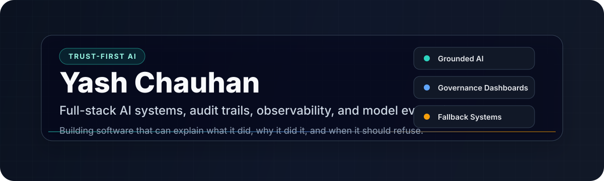

  

  
  
  
  

## Building AI Systems That Can Be Inspected

I build full-stack AI and ML systems where the important part is not just the model output, but the evidence behind it: citations, audit logs, refusal behavior, evaluation gates, fallback paths, and operator-facing dashboards.

My current anchor project is [GlassBox](https://github.com/yash-vks-chauhan/Glassbox), an auditable wealth-advisory AI agent built around a simple thesis: in regulated domains, a system must be able to show what it knew, what it used, what it rejected, and why it answered.

## Portfolio Snapshot

<table>
  <tr>
    <td width="50%" valign="top">
      <h3><a href="https://github.com/yash-vks-chauhan/Glassbox">GlassBox</a></h3>
      
<strong>Auditable wealth-advisory AI agent.</strong>

      
Grounded answers, cited sources, refusal logic, claim verification, trust scoring, determinism checks, and replayable decision trails.

      
<code>Python</code> <code>FastAPI</code> <code>Next.js</code> <code>TypeScript</code> <code>scikit-learn</code> <code>PostgreSQL</code>

    </td>
    <td width="50%" valign="top">
      <h3><a href="https://github.com/yash-vks-chauhan/Autoscaler">Autoscaler</a></h3>
      
<strong>Kubernetes auto-healing and observability platform.</strong>

      
Live metrics, anomaly detection, incident reasoning, chaos testing, Kubernetes-native healing actions, and fallback ML.

      
<code>Kubernetes</code> <code>NestJS</code> <code>FastAPI</code> <code>Prometheus</code> <code>TimescaleDB</code> <code>Next.js</code>

    </td>
  </tr>
  <tr>
    <td width="50%" valign="top">
      <h3><a href="https://github.com/yash-vks-chauhan/CT-Denoising-U-Net">CT-Denoising-U-Net</a></h3>
      
<strong>Medical image denoising pipeline.</strong>

      
U-Net based artifact reduction with preprocessing, model training, CLI inference, Streamlit inspection, and image-quality metrics.

      
<code>Python</code> <code>TensorFlow</code> <code>U-Net</code> <code>Streamlit</code> <code>Jupyter</code>

    </td>
    <td width="50%" valign="top">
      <h3><a href="https://github.com/yash-vks-chauhan/Kalakraftdev">KalaKraft</a></h3>
      
<strong>Premium e-commerce platform for art products.</strong>

      
Storefront, admin panel, authentication, order workflows, analytics, real-time updates, and polished product UI.

      
<code>Next.js</code> <code>TypeScript</code> <code>Prisma</code> <code>PostgreSQL</code> <code>Firebase Auth</code>

    </td>
  </tr>
</table>

## Capability Map

| Layer | What I care about |
| --- | --- |
| AI product behavior | Grounded generation, retrieval, refusals, citations, verification, fallback paths |
| Evaluation | Determinism checks, hallucination scoring, answerability routing, regression gates |
| Backend systems | FastAPI, NestJS, REST APIs, WebSockets, auth, rate limits, structured logs |
| Data and audit | PostgreSQL, TimescaleDB, vector search, provenance records, replayable traces |
| Frontend | Next.js, React, TypeScript, Tailwind, dashboards, charts, operator workflows |
| Infrastructure | Docker, Kubernetes, Prometheus, AWS-oriented deployment, production runbooks |

## Stack

  
  
  
  
  
  
  
  
  
  

## Current Build Log

- Turning GlassBox into a production-style AI governance demo.
- Improving model evaluation gates for grounding, answerability, and deterministic behavior.
- Building projects that expose architecture, system behavior, and failure modes instead of hiding them behind a demo screen.

## GitHub Signal

  
  

## Contact

The best place to inspect my work is here on GitHub: [@yash-vks-chauhan](https://github.com/yash-vks-chauhan).

<!-- Add these when ready:
- Portfolio:
- LinkedIn:
- Resume:
- Email:
-->
