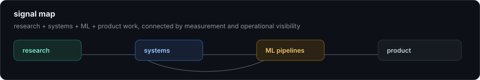

# Yash Chauhan

<p>
  <a href="https://www.linkedin.com/in/yash-vks-chauhan"></a>
  <a href="https://github.com/yash-vks-chauhan?tab=repositories"></a>
  
  
</p>

```txt
profile > Yash Chauhan
mode    > AI/ML engineering, full-stack systems, observability
base    > Chennai, India | B.Tech CSE, AI/ML specialization
recent  > IIT Madras research intern | Hindalco predictive-maintenance intern
signal  > I like systems where the evidence, failure path, and metrics are visible.
```

<p align="center">
  
</p>

## Choose A Mode

<details open>
<summary><strong>Research mode</strong> - data, metrics, and policy-facing analysis</summary>

- Research Intern at IIT Madras working on emergency medical response analytics.
- Co-authored an under-review paper using 3.59M ambulance dispatch records from Tamil Nadu 108 EMS.
- Built anomaly and counterfactual-response-time pipelines with autoencoders, XGBoost, SHAP, OSMnx, NetworkX, and geospatial analysis.
- Designed operational metrics including Time Drift Index and Quantum Stability Index for district-level stability and equity analysis.

`Python` `Pandas` `NumPy` `SciPy` `XGBoost` `SHAP` `OSMnx` `NetworkX` `Docker`

</details>

<details>
<summary><strong>Systems mode</strong> - Kubernetes, incidents, dashboards, recovery loops</summary>

- Building [AutoScaler](https://github.com/yash-vks-chauhan/Autoscaler), a local-first Kubernetes auto-healing and observability platform.
- Uses Isolation Forest, LSTM autoencoders, LLM reasoning, Random Forest fallback, SHAP explanations, chaos injection, and watchdog health checks.
- Runs as real Kubernetes components instead of a static mock: metrics, AI engine, dashboard, healing controller, Redis, Prometheus, and TimescaleDB.

`Kubernetes` `Docker` `Prometheus` `TimescaleDB` `Redis` `NestJS` `FastAPI` `Next.js`

</details>

<details>
<summary><strong>ML mode</strong> - medical imaging, predictive maintenance, model quality</summary>

- Built [CT-Denoising-U-Net](https://github.com/yash-vks-chauhan/CT-Denoising-U-Net), a medical image denoising pipeline for CT and X-ray scans.
- Achieved about 12 dB PSNR gain and about 95% noise reduction on lung CT slices.
- At Hindalco, worked on predictive-maintenance models with Proficy Historian, MTell, ARIMA, anomaly detection, and Power BI.
- Hindalco impact: reduced unscheduled downtime by 20% and maintenance costs by 15% through early failure detection.

`TensorFlow` `Keras` `OpenCV` `scikit-image` `ARIMA` `Power BI` `Jupyter`

</details>

<details>
<summary><strong>Product mode</strong> - full-stack apps with real workflows</summary>

- Built [KalaKraft](https://github.com/yash-vks-chauhan/Kalakraftdev), a marketplace for hand-crafted resin art.
- Implemented storefront flows, admin dashboard, inventory, coupons, reviews, support tickets, media optimization, auth, real-time order updates, and email flows.
- I care about complete products: not just screens, but auth, data, admin paths, feedback loops, and production deployment.

`Next.js` `React` `TypeScript` `PostgreSQL` `Prisma` `Firebase` `Cloudinary` `Pusher` `Vercel`

</details>

## Featured Projects

| Project | Why it matters | Stack |
| --- | --- | --- |
| [GlassBox](https://github.com/yash-vks-chauhan/Glassbox) | Auditable wealth-advisory AI: grounded answers, refusal routing, claim verification, trust metrics, and replayable audit trails. | FastAPI, Next.js, scikit-learn, PostgreSQL |
| [AutoScaler](https://github.com/yash-vks-chauhan/Autoscaler) | Kubernetes self-healing platform with anomaly detection, chaos testing, explainability, and fallback ML. | Kubernetes, Prometheus, TimescaleDB, NestJS, FastAPI |
| [CT-Denoising-U-Net](https://github.com/yash-vks-chauhan/CT-Denoising-U-Net) | Medical-image denoising pipeline with U-Net training, inference, dashboards, and quality metrics. | TensorFlow, OpenCV, Streamlit, Jupyter |
| [KalaKraft](https://github.com/yash-vks-chauhan/Kalakraftdev) | Full-stack commerce product with customer, admin, inventory, analytics, real-time, and deployment workflows. | Next.js, TypeScript, Prisma, Firebase |

## Proof Points

| Area | Evidence |
| --- | --- |
| Research scale | 3.59M ambulance dispatch records, 38 districts, 44 emergency types |
| Model evaluation | WMAPE 8.37% counterfactual benchmark, PSNR / SSIM / MSE image-quality tracking |
| Operational ML | 8,567 anomalous dispatch events, 5,000+ simulated ambulance trips, 100+ data quality checks |
| Industrial impact | 20% downtime reduction and 15% maintenance-cost reduction during predictive-maintenance work |
| Certifications | AWS Cloud Practitioner, AWS Certified Machine Learning - Specialty, DeepLearning.AI ML/DL specializations |

## Tools I Reach For

<p>
  
  
  
  
  
  
  
  
  
  
</p>

## What I Care About

I like projects where the hard parts are visible: what data enters the system, what decisions are made, what confidence means, what gets logged, what happens when something fails, and how someone can debug it later.

<!-- Add when ready:
- Portfolio:
- Resume:
- Email:
-->
