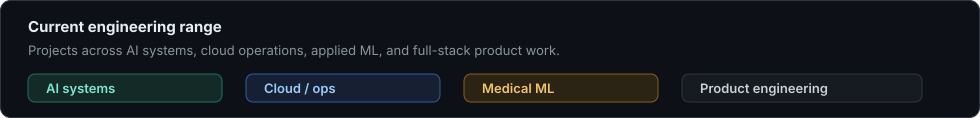

# Yash Chauhan

  
  
  
  

I build AI-backed products and infrastructure: systems that combine model behavior, backend contracts, data flow, dashboards, and deployment concerns.

I am most interested in projects where software has to be more than a demo: it needs clear failure behavior, useful observability, understandable interfaces, and enough structure that another engineer can inspect how it works.

  

## What I Build

- AI systems with retrieval, evaluation, refusal logic, fallback paths, and auditability.
- Cloud and operations tools that surface incidents, metrics, service health, and recovery actions.
- Applied ML pipelines with training, inference, metrics, and inspection workflows.
- Full-stack products with real user flows, admin flows, authentication, data models, and polished UI.

## Featured Work

<table>
  <tr>
    <td width="50%" valign="top">
      <h3><a href="https://github.com/yash-vks-chauhan/Glassbox">GlassBox</a></h3>
      
Auditable AI agent for wealth-advisory workflows.

      
Uses grounded retrieval, claim verification, refusal routing, audit replay, trust scoring, and a governance dashboard.

      

        
        
        
        
      

    </td>
    <td width="50%" valign="top">
      <h3><a href="https://github.com/yash-vks-chauhan/Autoscaler">Autoscaler</a></h3>
      
Kubernetes auto-healing and observability platform.

      
Combines live metrics, anomaly detection, incident reasoning, chaos testing, Kubernetes recovery actions, and fallback ML.

      

        
        
        
        
      

    </td>
  </tr>
  <tr>
    <td width="50%" valign="top">
      <h3><a href="https://github.com/yash-vks-chauhan/CT-Denoising-U-Net">CT-Denoising-U-Net</a></h3>
      
Medical image denoising pipeline for CT and X-ray scans.

      
Includes preprocessing, U-Net training, CLI inference, Streamlit inspection, and PSNR / SSIM / MSE evaluation.

      

        
        
        
        
      

    </td>
    <td width="50%" valign="top">
      <h3><a href="https://github.com/yash-vks-chauhan/Kalakraftdev">KalaKraft</a></h3>
      
Full-stack e-commerce platform for art products.

      
Includes storefront flows, authentication, admin workflows, product management, orders, analytics, real-time features, and polished UI.

      

        
        
        
        
      

    </td>
  </tr>
</table>

## Engineering Surface

| Area | Working with |
| --- | --- |
| AI / ML | RAG, model evaluation, scikit-learn, TensorFlow, U-Net, anomaly detection |
| Backend | FastAPI, NestJS, REST APIs, WebSockets, auth, rate limiting, structured logs |
| Frontend | Next.js, React, TypeScript, Tailwind, dashboards, charts, product flows |
| Data | PostgreSQL, TimescaleDB, vector stores, audit logs, replayable traces |
| Infrastructure | Docker, Kubernetes, Prometheus, AWS-oriented deployment |

## Engineering Taste

I like projects where the hard parts are visible: what data enters the system, what decisions are made, what gets logged, what happens when confidence is low, and how someone can debug the system later.

GitHub is where I keep the work: [@yash-vks-chauhan](https://github.com/yash-vks-chauhan)

<!-- Add when ready:
- Portfolio:
- LinkedIn:
- Resume:
- Email:
-->
