<!--
═══════════════════════════════════════════════════════════════════════════
 yash-vks-chauhan · mission control README
 ───────────────────────────────────────────────────────────────────────────
 if you're reading this, you opened the raw artifact. nice.
 the HUD timer, the commit-30d count, the telemetry panel, and the
 audit log down at line ~85 are not decorative — they're regenerated
 every 6h from the live GitHub API by .github/workflows/telemetry.yml.
 sources of truth:
   render:   .github/scripts/update_telemetry.py
   schedule: .github/workflows/telemetry.yml
   assets:   assets/*.svg
 ═══════════════════════════════════════════════════════════════════════════
-->

<p align="center">
  
</p>

> **the HUD above is alive.** the `T+` timer, the `commits / 30d` count, and the `last push` timestamp are not decorative — a github action regenerates them every 6 hours by querying the github api and rewriting these SVGs in place. you're looking at a self-observing artifact, which is the same thing the projects below are about: systems that can _explain themselves_.

```txt
> downlink established. listening.
> i build AI/ML systems where the hard parts are inspectable —
> the data pipeline, the failure path, the metric, the audit trail,
> the reason a decision was made.
> if a model demos great but won't explain itself, i'd rather not ship it.
```

<p align="center">
  <a href="https://www.linkedin.com/in/yash-vks-chauhan"></a>
  <a href="mailto:yash.vks.chauhan@gmail.com"></a>
  <a href="https://github.com/yash-vks-chauhan?tab=repositories"></a>
  
  
</p>

---

## ► TRAJECTORY

every milestone is a **burn** — a controlled change in heading. burn 06 (IIT Madras research) is the longest one still firing.

<p align="center">
  
</p>

---

## ► PAYLOAD MANIFEST

6 systems in the cargo bay. 2 currently firing in orbit, 2 deployed to production, 1 ongoing research, 1 industrial re-entry complete. each one earned its slot.

<p align="center">
  
</p>

| ID        | status        | repo / artifact                                                                       | role on mission                                                                  |
| --------- | ------------- | ------------------------------------------------------------------------------------- | -------------------------------------------------------------------------------- |
| `PYL-001` | **firing**    | [**Glassbox**](https://github.com/yash-vks-chauhan/Glassbox)                          | grounded LLM · refusal-routing · audit replay · trust scoring                    |
| `PYL-002` | **firing**    | [**Autoscaler**](https://github.com/yash-vks-chauhan/Autoscaler)                      | self-healing K8s · IsolationForest + LSTM-AE · LLM RCA w/ in-cluster RF fallback |
| `PYL-003` | ongoing       | [**CT-Denoising-U-Net**](https://github.com/yash-vks-chauhan/CT-Denoising-U-Net)      | mixed-precision U-Net · **+12 dB PSNR** · **95% noise↓** on lung CT              |
| `PYL-004` | active orbit  | IIT Madras · ambulance dispatch _(closed-source research)_                            | **3.59M** records · XGBoost + SHAP · **WMAPE 8.37%** · TDI & QSI stability       |
| `PYL-005` | deployed      | [**Kalakraftdev**](https://github.com/yash-vks-chauhan/Kalakraftdev)                  | prod marketplace · Next.js · Prisma · Pusher real-time · Sendinblue flows        |
| `PYL-006` | re-entered    | Hindalco · electrical & instrumentation _(industrial · private)_                      | predictive maintenance · MTell · ARIMA · **downtime −20%** · **maint cost −15%** |

<sub><i><strong>also in the archive (proofs callable, not pictured):</strong> <code>fraud-detection-system</code> (TF DNN · 97.34% acc · SMOTE) · <code>appointment-ticketing-app</code> (RN + Expo + TS + SQL · RBAC)</i></sub>

---

## ► PRE-FLIGHT CHECKLIST

`☑` = flight-rated · `◧` = arming · `☐` = on the manifest, not yet flown

<table>
<tr>
<td valign="top" width="33%">

**core stack**

- `☑` Python · Pandas · NumPy · SciPy
- `☑` TypeScript · C++ · SQL
- `☑` git · docker · linux
- `☑` OOP · DSA · OS · CompOrg
- `◧` Rust _(personal-time burn)_

</td>
<td valign="top" width="34%">

**ML / DL**

- `☑` scikit-learn · XGBoost · SHAP
- `☑` TensorFlow · Keras · PyTorch
- `☑` anomaly detection · CV · medical imaging
- `☑` ARIMA · SMOTE · CLAHE · AMP
- `◧` diffusion models · GANs _(CT roadmap)_

</td>
<td valign="top" width="33%">

**systems / product**

- `☑` FastAPI · Next.js · React · React Native
- `☑` PostgreSQL · Prisma · Firebase
- `☑` Prometheus · Kubernetes · Docker
- `☑` Cloudinary · Pusher · Sendinblue
- `☐` Terraform · gRPC · Kafka _(next quarter)_

</td>
</tr>
</table>

**certifications · ground school**

- `▣` **AWS Cloud Practitioner** — _Amazon Web Services_
- `▣` **AWS Certified Machine Learning – Specialty** — _Amazon Web Services · armed_
- `▣` **Deep Learning Specialization** — _DeepLearning.AI · Andrew Ng_
- `▣` **Machine Learning Specialization** — _DeepLearning.AI · Andrew Ng_
- `▣` **Mathematics for ML** — _DeepLearning.AI · Andrew Ng_
- `▣` **MATLAB ML toolchain** — _MathWorks · Onramp · ML · Data Viz_

---

## ► TELEMETRY · LIVE

<p align="center">
  
</p>

> the panel above auto-refreshes every 6h. a github action [`.github/workflows/telemetry.yml`](.github/workflows/telemetry.yml) runs [`update_telemetry.py`](.github/scripts/update_telemetry.py), which fetches my recent activity from the github rest api and patches the SVG in place — sentinel-delimited regions, no client-side script, no scraping shim. orange bars are commit days > μ + 2σ, flagged as anomalous activity.

---

## ► MISSION LOG

times are mission-elapsed days since `T+0` (B.Tech enrollment · Aug 2023). every entry is documented in code, certs, or commits — no fluff.

| timestamp        | event                                                                                  |
| ---------------- | -------------------------------------------------------------------------------------- |
| `T+0000`         | mission start · SRM IST · B.Tech CSE specialization in AI/ML                           |
| `T+0001 → 0090`  | DeepLearning.AI · ML, DL, and Math-for-ML specializations (Andrew Ng)                  |
| `T+0150`         | MathWorks MATLAB ML toolchain · AWS Cloud Practitioner cert                            |
| `T+0365`         | **II2S Hack2Skill 2024** · top 35% of 300+ teams                                       |
| `T+0395`         | full-stack ticketing app · RN + Expo + TypeScript + SQL                                |
| `T+0515`         | fraud-detection system · TensorFlow · **97.34% acc** · SMOTE rebalance                 |
| `T+0540`         | CT denoising U-Net · **+12 dB PSNR**, **95% noise↓** · CLAHE preproc                   |
| `T+0575`         | **IIT Madras · research intern** · ambulance dispatch analytics (active)               |
| `T+0670`         | Kalakraft v1 · Next.js · Prisma · production deploy                                    |
| `T+0670 → 0700`  | **Hindalco · summer intern** · electrical & instrumentation · PdM (downtime −20%)      |
| `T+now`          | active orbit · Glassbox + Autoscaler · AWS ML Specialty cert armed                     |

---

## ► ANOMALY REPORTS

post-mortems on the moments that recalibrated the mission. no successes, only what surprised me.

<details>
<summary><strong>AR-01</strong> · <em>the model works, but no one trusts it</em></summary>
<br/>

a fraud model that hits **97.34%** in a notebook is not the same as a fraud model anyone will deploy. on the path to prod the questions stopped being _"what's the F1"_ and started being _"why did it block THIS transaction."_ that's the gap **Glassbox** is built to close — every refusal carries its evidence, every score carries its receipts. accuracy is the cover charge; auditability is what gets you in the room.

</details>

<details>
<summary><strong>AR-02</strong> · <em>in-cluster fallbacks are not a backup, they're the spec</em></summary>
<br/>

**Autoscaler**'s first design assumed the LLM root-cause-analyzer would always be reachable. spoiler: it wasn't. the in-cluster Random Forest stopped being a fallback and became the contract — anything the cluster decides has to be decidable without leaving the cluster. external calls are the optimization, not the dependency. if your "self-healing" system needs an outbound TLS handshake to recover, it's not self-healing.

</details>

<details>
<summary><strong>AR-03</strong> · <em>datasets are not their schemas</em></summary>
<br/>

**3.59 million** EMS records arrived as a CSV. the schema was clean. the data was not. **100+** quality checks later, the interesting question stopped being _"what model"_ and became _"what data is actually here."_ ARIMA + XGBoost are easy. distinguishing a monsoon-induced delay from a construction-zone delay from a CSV that doesn't know the difference — that's the work.

</details>

<details>
<summary><strong>AR-04</strong> · <em>predictive maintenance is a UX problem first</em></summary>
<br/>

at **Hindalco** the anomaly model could detect drift weeks ahead. the wins (downtime **−20%**, cost **−15%**) didn't come from a sharper model. they came from getting the right alert to the right maintenance engineer at the right moment, in a tool they were already in. the model was the easy part. the integration with Proficy Historian, MTell, and Power BI was the actual work.

</details>

---

## ► COMMS

<p align="center">
  
</p>

[](mailto:yash.vks.chauhan@gmail.com)
[](https://www.linkedin.com/in/yash-vks-chauhan)
[](https://github.com/yash-vks-chauhan)

---

## ► ENGINEERING TASTE

i like projects where the hard parts are **inspectable**: what data entered, what changed, what _confidence_ actually means, what failed, what recovered, and what evidence is left behind. the systems i want to build are the kind that, when something goes wrong, _explain themselves_ — without anyone having to ssh into a box at 2am to find out.

> **a hypothesis i'm testing:** that the next decade of useful ML systems will be judged not on benchmark accuracy but on _auditability_. that's the bet behind Glassbox, Autoscaler, and the way i wrote this very README.

---

## ► BLACK BOX

```txt
═══════════════════════════════════════════════════════════════════════════════
  FLIGHT RECORDER · yash-01                                  end-of-transmission
───────────────────────────────────────────────────────────────────────────────
  callsign      :  chauhan, y.                              ▮▮▮▮▮▮▮▮▮▮▮▮▮▮▮▮▮▮
  mission       :  AI/ML systems that explain themselves                  ▮▮▮▮▮
  primary phase :  IIT-M research · Glassbox · Autoscaler              ▮▮▮▮▮▮▮▮
  spec          :  CSE · Artificial Intelligence & Machine Learning  ▮▮▮▮▮▮▮▮▮▮
  affiliation   :  SRM IST · IIT Madras (research) · Hindalco (alumni)   ▮▮▮▮▮▮
  certs armed   :  AWS ML Specialty · AWS CP · DL.AI ×3 · MathWorks ×4
───────────────────────────────────────────────────────────────────────────────
  log integrity :  ✓ verified           audit trail :  github.com commits
  next sample   :  +6h                  signal lock :  ◉ green
═══════════════════════════════════════════════════════════════════════════════
                  > end of recording. mission in progress. _
```

<sub><i><strong>about this README:</strong> it is a self-observing artifact. the HUD's <code>T+</code> timer, the <code>commits / 30d</code> counter, the <code>last push</code> timestamp, the trajectory's <em>now</em> label, the telemetry panel's bars, language mix, repo / star / commit stats, and the latest-push audit log are all regenerated from the live github api by <a href="./.github/workflows/telemetry.yml">.github/workflows/telemetry.yml</a> running <a href="./.github/scripts/update_telemetry.py">update_telemetry.py</a>. orange bars in the commit chart are days where my activity exceeded μ + 2σ — i.e., anomalies in my own behavior, flagged the same way Autoscaler would flag a pod. fitting, since the whole point of this profile is that the systems i build should be able to explain themselves. so should i.</i></sub>
