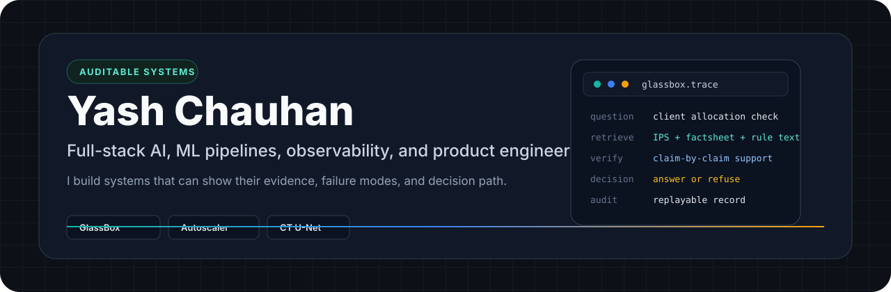

  

  
  
  
  

## Current Work

I build full-stack AI systems with an emphasis on evidence, observability, and failure behavior.

My main project right now is [GlassBox](https://github.com/yash-vks-chauhan/Glassbox): a wealth-advisory AI agent that answers from cited sources, verifies claims, refuses unsupported questions, records decision trails, and exposes trust metrics through a governance dashboard.

The part I care about most is the layer around the model: retrieval quality, refusal logic, evaluation gates, fallback paths, audit records, and whether another person can replay what the system did later.

## Projects Worth Opening

<table>
  <tr>
    <td width="50%" valign="top">
      <h3><a href="https://github.com/yash-vks-chauhan/Glassbox">GlassBox</a></h3>
      
Auditable AI agent for regulated finance workflows.

      
Retrieval, grounded answers, claim verification, refusal routing, audit replay, determinism checks, and trust scoring.

      

        
        
        
        
      

    </td>
    <td width="50%" valign="top">
      <h3><a href="https://github.com/yash-vks-chauhan/Autoscaler">Autoscaler</a></h3>
      
Local-first Kubernetes auto-healing and observability platform.

      
Live metrics, anomaly detection, incident reasoning, chaos testing, Kubernetes recovery actions, and fallback ML.

      

        
        
        
        
      

    </td>
  </tr>
  <tr>
    <td width="50%" valign="top">
      <h3><a href="https://github.com/yash-vks-chauhan/CT-Denoising-U-Net">CT-Denoising-U-Net</a></h3>
      
Medical image denoising pipeline for CT and X-ray scans.

      
Preprocessing, U-Net training, CLI inference, Streamlit inspection, and PSNR / SSIM / MSE evaluation.

      

        
        
        
        
      

    </td>
    <td width="50%" valign="top">
      <h3><a href="https://github.com/yash-vks-chauhan/Kalakraftdev">KalaKraft</a></h3>
      
Full-stack e-commerce platform for art products.

      
Storefront, auth, admin workflows, product management, orders, analytics, real-time updates, and polished UI.

      

        
        
        
        
      

    </td>
  </tr>
</table>

## Engineering Surface

| Area | What I work on |
| --- | --- |
| AI systems | RAG, grounded generation, refusal logic, claim verification, model fallback |
| Evaluation | Determinism checks, hallucination scoring, answerability routing, regression gates |
| Backend | FastAPI, NestJS, REST APIs, WebSockets, auth, rate limits, structured logs |
| Frontend | Next.js, React, TypeScript, Tailwind, dashboards, charts, operator workflows |
| Data | PostgreSQL, TimescaleDB, vector stores, provenance logs, replayable traces |
| Infrastructure | Docker, Kubernetes, Prometheus, AWS-oriented deployment |

## Notes

I like systems where the impressive part is visible in the contracts: what data flows through the system, what happens when confidence is low, what gets logged, how failures degrade, and how a future operator can debug it.

That is the thread behind my recent work: not just model demos, but software around models.

## Contact

GitHub is the best place to inspect my work: [@yash-vks-chauhan](https://github.com/yash-vks-chauhan)

<!-- Add when ready:
- Portfolio:
- LinkedIn:
- Resume:
- Email:
-->
